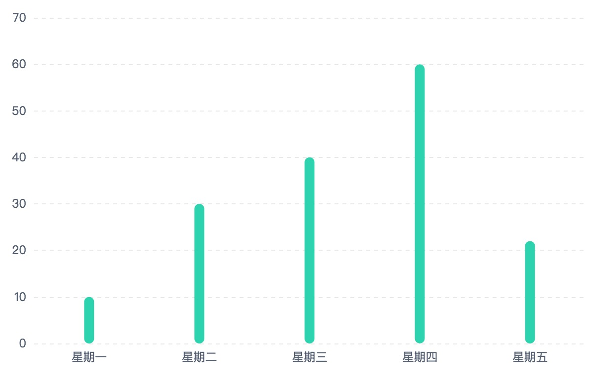

# ylf-charts
> the encapsulation two times of the framework based echarts


基于 echarts 二次封装 ，简单、方便、实用、数据格式对后端友好

## Quick Start

### Browser

引入`Echarts`、`lodash`

```html
<script src="https://cdn.bootcss.com/echarts/4.0.4/echarts.min.js"></script>
<script src="https://cdn.bootcss.com/lodash.js/4.17.5/lodash.min.js"></script>

```

引入`ylf-charts`

```html

<script src="./ylf-charts.js"></script>

```

创建一个容器标签
```html
  <div id="chart" style="width:600px;height:400px"></div>

```

创建实例

```js
const $chart = new ylfCharts.Bar({
    el :document.querySelector('#chart'),
    sub:'base',
    props:{
        specialProp:{
            bar: {
                width: '10',
                barBorderRadius: 5
            }
        }
    }
})

```

打开浏览器查看


### ES

```
  npm install ylf-echarts -D
  // or
  yarn add ylf-echarts

```

引入
```js
   import ylfEcharts from 'ylf-echarts'

   new ylfCharts.Bar({..})
```

### AMD

requirejs

```js
require.config({
    baseUrl:'./',
    paths: {
        'echarts': '../lib/echarts.min',
        'lodash': '../lib/lodash.min',
        'ylfCharts':'../../dist/ylfCharts'
    }
});


define(['ylfCharts'], function(ylfCharts){
    // ...
    const vm = new ylfCharts.Bar({
        //...
    })
    // ...
})
```
